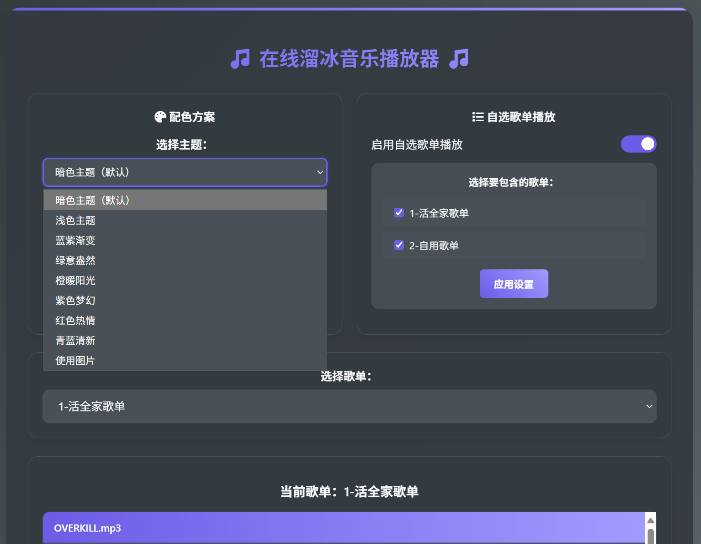

# 在线溜冰音乐播放器



一个功能丰富的Web音乐播放器，支持歌词显示、翻译歌词、分页浏览、自选歌单播放和多种配色方案等功能。

## 功能特性

### 🎵 音乐播放
- 支持多种音频格式（MP3、M4A、AAC、WAV、OGG）
- 多种播放模式：单曲循环、顺序播放、随机播放
- 自动播放下一首歌曲
- **自选歌单播放**：支持从多个歌单中选择歌曲进行播放

### 📄 歌词显示
- **自动歌词加载**：点击播放按钮后，如果有与歌曲同名的.lrc文件，会自动显示歌词
- **翻译歌词支持**：支持中英文对照歌词显示
- **歌词同步**：歌词会随着音乐播放进度自动高亮和滚动
- **智能解析**：自动识别相同时间戳的歌词行作为翻译
- **多位置支持**：支持多种歌词文件存放位置

### 🎨 现代化界面
- **多种配色方案**：8种预设配色方案，包括浅色、暗色、渐变等
- **实时切换**：配色方案可实时切换，无需刷新页面
- **记忆功能**：配色方案会自动保存到本地存储
- **卡片式布局**：清晰的功能分区，提升用户体验
- 响应式设计，支持移动设备
- 流畅的动画效果
- 美观的按钮和控件样式

### 📱 分页浏览
- 每页显示10首歌曲
- 自动切换到正在播放的歌曲所在页码
- 当前播放歌曲高亮显示

### 🌐 自选歌单播放
- **开关控制**：通过开关轻松启用/禁用自选歌单播放
- **歌单选择**：可选择要包含在自选歌单播放中的歌单
- **智能显示**：自选歌单模式下显示歌曲名称和所属歌单
- **无缝切换**：可在单歌单和自选歌单模式间自由切换

## 配色方案

项目提供8种精心设计的配色方案：

1. **浅色主题（默认）** - 明亮清爽的浅色系，适合日常使用
2. **蓝紫渐变** - 经典蓝紫色渐变
3. **暗色主题** - 深色背景，适合夜间使用
4. **绿意盎然** - 清新的绿色系
5. **橙暖阳光** - 温暖的橙色系
6. **紫色梦幻** - 浪漫的紫色系
7. **红色热情** - 热烈的红色系
8. **青蓝清新** - 清新的青蓝色系

## 歌词文件格式

歌词文件使用标准的LRC格式，支持翻译歌词：

```
[00:00:00]Hello World!
[00:00:00]你好世界!
[00:03:15]This is a song
[00:03:15]这是一首歌
```

**格式说明：**
- 时间标签：`[mm:ss.xx]` 或 `[mm:ss:xx]`
- 相同时间戳的连续两行会被识别为原文和翻译
- 翻译歌词会以较小字体显示在原文下方

## 文件结构

### 推荐的文件结构（歌词与音乐分离）

```
music_player/
├── index.html          # 主页面
├── style.css           # 样式文件
├── script.js           # JavaScript逻辑
├── backend.php         # 后端API
├── debug.php           # 调试页面
├── background.jpg      # 背景图片
└── music/             # 音乐文件夹
    ├── 歌单1/
    │   ├── 歌曲1.mp3
    │   ├── 歌曲2.m4a
    │   └── lyrics/     # 歌词子文件夹
    │       ├── 歌曲1.lrc
    │       └── 歌曲2.lrc
    └── 歌单2/
        ├── 歌曲3.mp3
        └── lyrics/
            └── 歌曲3.lrc
```

### 兼容的文件结构（歌词与音乐混放）

```
music_player/
└── music/
    ├── 歌单1/
    │   ├── 歌曲1.mp3
    │   ├── 歌曲1.lrc    # 歌词文件与音乐文件同目录
    │   ├── 歌曲2.m4a
    │   └── 歌曲2.lrc
    └── 歌单2/
        ├── 歌曲3.mp3
        └── 歌曲3.lrc
```

## 歌词文件搜索优先级

系统会按以下顺序查找歌词文件：

1. `music/歌单/歌曲名.lrc` - 与音乐文件同目录
2. `music/歌单/lyrics/歌曲名.lrc` - 歌单内的歌词子文件夹
3. `lyrics/歌单/歌曲名.lrc` - 独立的歌词文件夹
4. `music/lyrics/歌单/歌曲名.lrc` - 全局歌词文件夹

## 使用方法

1. 将音乐文件放入 `music/` 文件夹下的子文件夹中
2. 如需显示歌词，创建与歌曲同名的 `.lrc` 文件
   - **推荐**：在歌单文件夹内创建 `lyrics/` 子文件夹存放歌词
   - **兼容**：将歌词文件与音乐文件放在同一目录
3. 启动Web服务器（如Apache、Nginx等）
4. 访问 `index.html` 开始使用

### 自选歌单播放使用步骤

1. 打开"自选歌单播放"开关
2. 在歌单选择区域勾选要包含的歌单
3. 点击"应用设置"按钮
4. 开始享受自选歌单播放功能

### 配色方案切换

1. 在页面顶部的"配色方案"设置卡片中选择喜欢的配色
2. 配色方案会立即生效并自动保存
3. 下次访问时会自动应用上次选择的配色方案

## 界面布局

项目采用卡片式布局设计：

- **设置面板**：配色方案和自选歌单播放设置
- **歌单选择**：选择要播放的歌单
- **歌曲列表**：显示当前歌单的歌曲
- **播放控制**：音频播放器和播放模式选择
- **歌词显示**：实时歌词同步显示

## 故障排除

如果遇到问题，可以访问 `debug.php` 页面来检查：

- PHP配置信息
- 文件系统状态
- 文件权限
- 文件名编码
- API响应测试

## 技术栈

- **前端**：HTML5、CSS3、JavaScript (ES6+)
- **后端**：PHP
- **音频**：HTML5 Audio API
- **样式**：CSS Grid、Flexbox、渐变、动画、CSS变量

## 浏览器兼容性

- Chrome 60+
- Firefox 55+
- Safari 12+
- Edge 79+

## 更新日志

### v2.3.0
- 🎨 优化整体UI布局，采用卡片式设计
- 🎨 修复暗色模式视觉问题
- 🎨 将浅色主题设为默认配色
- 🔧 优化配色方案变量系统
- 🔧 改进设置面板布局
- 🔧 优化命名：跨歌单播放 → 自选歌单播放
- 🔧 提升用户体验和视觉一致性

### v2.2.0
- ✨ 新增自选歌单播放功能
- ✨ 新增8种配色方案
- ✨ 配色方案实时切换和记忆功能
- ✨ 自选歌单播放的智能歌单选择
- 🎨 使用CSS变量实现主题系统
- 🔧 优化自选歌单播放的用户体验
- 🔧 改进歌曲显示逻辑

### v2.1.0
- 🔧 优化文件扫描逻辑，提高兼容性
- 🔧 添加更好的错误处理和调试信息
- 🔧 支持多种歌词文件存放位置
- 🔧 改进文件名编码处理
- 🐛 修复XAMPP环境下的显示问题

### v2.0.0
- ✨ 新增歌词显示功能
- ✨ 支持翻译歌词
- ✨ 歌词同步播放
- ✨ 自动切换页码
- 🎨 全新现代化界面设计
- 🎨 响应式布局优化
- ⚡ 性能优化

### v1.0.0
- 🎵 基础音乐播放功能
- 📁 歌单管理
- 🔄 多种播放模式
- 📄 分页浏览

## 贡献

欢迎提交Issues和Pull Requests！

## 许可证

MIT License
